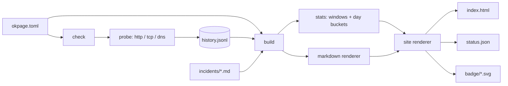

# okpage

[English](README.md) | [中文](README.zh.md) | [日本語](README.ja.md)

[](LICENSE) [](go.mod) [](CHANGELOG.md)  [](CONTRIBUTING.md)

**okpage：オープンソースの依存ゼロ CLI。サービスを probe し、どこにでもホストできる静的ステータスページを生成 —— 出力は純粋な HTML/JSON、インシデントはデータベースの行ではなく markdown ファイル。**


```bash
git clone https://github.com/JaydenCJ/okpage && cd okpage
go build -o okpage ./cmd/okpage    # single static binary, stdlib only
```

> プレリリース：v0.1.0 はまだどのレジストリにも公開されていません。上記の通りソースからビルドしてください（Go ≥1.22 なら可）。

## なぜ okpage？

ステータスページの仕事はただ一つ：自分のスタックが落ちている時に生きていること。だからこそそれをスタックの*上で*動かすこと——Uptime Kuma は Node プロセスとデータベースの 24 時間常駐が必要で、セルフホストのダッシュボードは自身の可用性を要求する——は静かに本末転倒であり、ホスティングサービスは本質的に 1 枚の HTML ファイルに月額課金します。okpage は静的サイトジェネレーターがブログを分割したのと同じ方法でこの問題を分割します：`okpage check` は cron から走り、サービスを probe し（ステータス/ボディ検証つき HTTP、TCP 接続、DNS 解決）、結果を素の JSON-lines ファイルに追記；`okpage build` はその履歴と markdown インシデントのフォルダを、自己完結の `index.html`、安定した `status.json`、サービス毎の SVG バッジへ変換します。出力はただのファイル——GitHub Pages でも S3 でもどんな素朴な Web サーバーにでも置けて、配信にあなたの側で動いている必要のあるものが何もないため、自分自身の障害をも生き延びます。履歴は git で diff でき、インシデントは障害の最中にスマホから SSH で書け、全体は依存ゼロの Go バイナリ 1 個です。

| | okpage | Atlassian Statuspage | Uptime Kuma | Upptime |
|---|---|---|---|---|
| 配信要件 | 任意の静的ホスト | 先方の SaaS | Node + DB の 24 時間稼働 | GitHub Pages のみ |
| 自分の障害を生き延びる | ✅ 静的ファイル | ✅ ただし有料 | ❌ それ自体が*あなたのスタック* | ✅ |
| probe の種類 | HTTP/TCP/DNS | agent/API | 多数 | HTTP + TCP ping |
| インシデント | markdown ファイル | Web フォーム、先方の DB | データベースの行 | GitHub issue |
| 機械可読な出力 | ✅ status.json + バッジ | API（有料プラン） | 独自 API | リポジトリ内 JSON |
| 完全オフライン / 閉域網で動く | ✅ | ❌ | ✅ | ❌ GitHub Actions 必須 |
| 費用 | 無料 | $29/月〜 | 無料 | 無料 |
| ランタイム依存 | 0（単一バイナリ） | n/a | Node + npm ツリー + DB | GitHub Actions |

<sub>依存数は 2026-07-13 に確認：okpage は Go 標準ライブラリのみ import；Uptime Kuma 2.x は直接の npm 依存 70+ に加え SQLite/MariaDB を挙げています。</sub>

## 特長

- **3 種の probe と本物の検証** —— HTTP GET/HEAD は厳密ステータスまたは任意 2xx ポリシーとボディ部分一致チェックに対応、TCP 接続、DNS 解決；サービス毎タイムアウトで並行実行。
- **出力はただのファイル** —— 自己完結の `index.html`（インライン CSS、JavaScript ゼロ、`prefers-color-scheme` でダークモード）、安定した `status.json`（`schema_version: 1`）、サービス毎の shields 風 SVG バッジ。バイトを返せるものなら何でもホストに。
- **インシデントは行ではなく markdown** —— インシデント毎に 1 ファイル、front matter に `title`/`date`/`status`/`affected`、サニタイズ付き markdown レンダラーで描画；git で履歴管理でき、障害の最中でも SSH 越しに書けます。
- **筋の通った履歴** —— 追記専用 JSON lines、アトミックな保持期間の刈り込み、連結するだけでマージ可能；壊れた行は行番号つきで報告し、決して推測しません。
- **正直な稼働率計算** —— 24h/7d/90d のローリングウィンドウと UTC 暦日バー（正常/劣化/停止/データなし）；「データなし」はデータなしとして描画し、0% にも 100% にも偽装しません。
- **決定的なビルド** —— `build` は config + history + incidents の純粋関数；同じ入力はバイト単位で同一のサイトを生み、再ビルドはきれいに diff できます。
- **依存ゼロ、cron ネイティブ** —— 静的 Go バイナリ 1 個；何かが落ちれば終了コード 1 なので `okpage check && …` がそのままゲートになります。テレメトリなし、設定したサービス以外のネットワークには触れません。

## クイックスタート

```bash
./okpage init status && cd status   # scaffold okpage.toml + incidents/
$EDITOR okpage.toml                 # declare your services
../okpage check --build             # probe, record, render into public/
```

実際にキャプチャした出力（1 サービスは意図的に停止中）：

```text
   up  Website                  1 ms  200
   up  API                      0 ms  200
 DOWN  Postgres                       dial tcp 127.0.0.1:5432: connect: connection refused
2 up, 1 down
wrote 5 files to public
  index.html
  status.json
  badge/website.svg
  badge/api.svg
  badge/postgres.svg
okpage: 1 of 3 services down
```

`public/status.json` はその機械可読の片割れ（実出力、抜粋）：

```text
{
  "tool": "okpage",
  "version": "0.1.0",
  "schema_version": 1,
  "title": "Acme Status",
  "as_of": "2026-07-13T10:32:27.544291091Z",
  "overall": "degraded",
  "services": [
    {
      "name": "Website",
      "state": "up",
      "latency_ms": 1,
      "last_checked": "2026-07-13T10:32:27.544291091Z",
      "uptime": {
        "24h": 100,
        "7d": 100,
        "90d": 100
      },
      "badge": "badge/website.svg"
    },
    …
```

本番運用は cron 2 行 —— 5 分毎に probe し、公開手段はお好みで：

```cron
*/5 * * * *  cd /srv/status && okpage check --build --quiet
7 * * * *    cd /srv/status && rsync -a public/ deploy@web:/var/www/status/
```

## 設定

`okpage.toml` は行番号つきエラーを出す厳格な TOML サブセット；未知のキーは拒否されるため、タイポがチェックを黙って無効化することはありません。完全なリファレンスは [docs/formats.md](docs/formats.md)。

| キー | 既定値 | 効果 |
|---|---|---|
| `title` | `"Status"` | ページ見出し |
| `output` | `"public"` | サイトの出力先 |
| `history` | `"history.jsonl"` | probe 履歴ファイル |
| `incidents` | `"incidents"` | インシデント markdown ディレクトリ |
| `retention_days` | `90` | これより古い履歴を刈り込む |
| `days` | `90` | サービス毎の日次バー数（1–365） |
| `timeout` | `"10s"` | 既定の probe タイムアウト |

各 `[[service]]`：`name`、`type`（`http`/`tcp`/`dns`）、続いて `url`/`method`/`expect_status`/`expect_body`（http）、`address`（tcp）、`hostname`（dns）、任意でサービス毎の `timeout`。

## インシデントはファイル

```markdown
---
title: Elevated API latency
date: 2026-07-10T14:30:00Z
status: resolved
affected: [API, Website]
---

A runaway backup job saturated disk IO. **Resolved** at 14:50 UTC.
```

ステータスは通常のエスカレーション階段に従います：`investigating` → `identified` → `monitoring` → `resolved`。本文は内蔵のサニタイズ付き markdown サブセットで描画——生の HTML はエスケープされ、`javascript:` 系リンクは無力化されるため、急いで書いたインシデントがページにスクリプトを注入することはあり得ません。

## 検証

このリポジトリは CI を同梱しません；上記の主張はすべてローカル実行で検証されます：

```bash
go test ./...            # 90 deterministic tests, no external network, < 5 s
bash scripts/smoke.sh    # end-to-end CLI check, prints SMOKE OK
```

## アーキテクチャ



## ロードマップ

- [x] v0.1.0 —— http/tcp/dns probe、刈り込みつき JSONL 履歴、markdown インシデント、静的 HTML/JSON/バッジ出力、`init`/`check`/`build` CLI、90 テスト + smoke スクリプト
- [ ] 状態変化時の Webhook/コマンドフック（`on_down = "ntfy publish …"`）
- [ ] 記録済み履歴からのレイテンシスパークラインと p95
- [ ] 計画メンテナンスの front matter（`status: scheduled`、未来日付）
- [ ] インシデントの RSS/Atom フィード
- [ ] `okpage watch` —— cron のないマシン向け、cron なしのインターバル probe

完全なリストは [open issues](https://github.com/JaydenCJ/okpage/issues) を参照。

## コントリビュート

issue・ディスカッション・PR を歓迎します —— ローカルの作業フロー（フォーマット、vet、テスト、`SMOKE OK`）は [CONTRIBUTING.md](CONTRIBUTING.md) へ。入門タスクは [good first issue](https://github.com/JaydenCJ/okpage/issues?q=is%3Aissue+is%3Aopen+label%3A%22good+first+issue%22) のラベルつき、設計の議論は [Discussions](https://github.com/JaydenCJ/okpage/discussions) で。

## ライセンス

[MIT](LICENSE)
