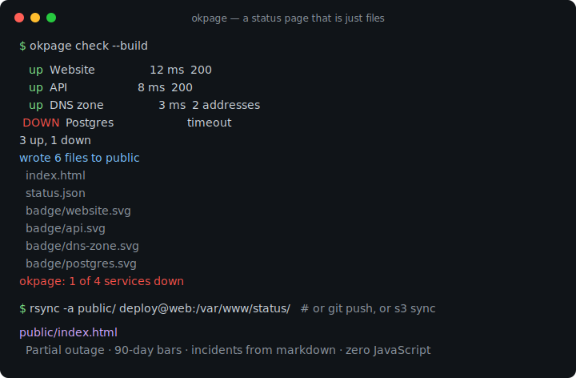
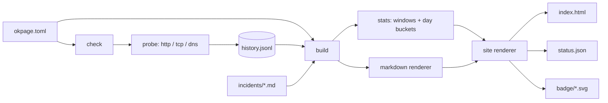

# okpage

[English](README.md) | [中文](README.zh.md) | [日本語](README.ja.md)

[](LICENSE) [](go.mod) [](CHANGELOG.md)  [](CONTRIBUTING.md)

**okpage：an open-source, zero-dependency CLI that probes your services and renders a static status page you can host anywhere — pure HTML/JSON output, incidents as markdown files instead of database rows.**



```bash
git clone https://github.com/JaydenCJ/okpage && cd okpage
go build -o okpage ./cmd/okpage    # single static binary, stdlib only
```

> Pre-release: v0.1.0 is not tagged on a package registry yet; build from source as above (any Go ≥1.22).

## Why okpage?

A status page has exactly one job: stay up when your stack is down. Which is why running one *on* your stack — Uptime Kuma needs a Node process and a database alive 24/7, self-hosted dashboards need their own uptime — quietly defeats the purpose, and hosted services charge monthly for what is fundamentally one HTML file. okpage splits the problem the way static-site generators split blogging: `okpage check` runs from cron, probes your services (HTTP with status/body assertions, TCP connect, DNS resolve), and appends results to a plain JSON-lines file; `okpage build` turns that history plus a folder of markdown incident files into a self-contained `index.html`, a stable `status.json`, and per-service SVG badges. The output is just files — push them to GitHub Pages, S3, or any dumb web server, and your status page survives your own outage because nothing of yours needs to be running to serve it. History diffs in git, incidents are editable from a phone over SSH mid-outage, and the whole thing is one Go binary with zero dependencies.

| | okpage | Atlassian Statuspage | Uptime Kuma | Upptime |
|---|---|---|---|---|
| Serving requirement | any static host | their SaaS | Node + DB running 24/7 | GitHub Pages only |
| Survives your own outage | ✅ static files | ✅ but paid | ❌ it *is* your stack | ✅ |
| Probe types | HTTP/TCP/DNS | agent/API | many | HTTP + TCP ping |
| Incidents | markdown files | web form, their DB | database rows | GitHub issues |
| Machine-readable output | ✅ status.json + badges | API (paid tiers) | own API | JSON in repo |
| Works fully offline / air-gapped | ✅ | ❌ | ✅ | ❌ needs GitHub Actions |
| Cost | free | from $29/mo | free | free |
| Runtime dependencies | 0 (one binary) | n/a | Node + npm tree + DB | GitHub Actions |

<sub>Dependency counts checked 2026-07-13: okpage imports the Go standard library only; Uptime Kuma 2.x lists 70+ direct npm dependencies plus SQLite/MariaDB.</sub>

## Features

- **Three probe types, real assertions** — HTTP GET/HEAD with exact-status or any-2xx policy and body-substring checks, TCP connect, and DNS resolution; concurrent execution with per-service timeouts.
- **Output is just files** — a self-contained `index.html` (inline CSS, zero JavaScript, dark mode via `prefers-color-scheme`), a stable `status.json` (`schema_version: 1`), and shields-style SVG badges per service. Host on anything that serves bytes.
- **Incidents are markdown, not rows** — one file per incident with `title`/`date`/`status`/`affected` front matter and a sanitizing markdown renderer; they version in git and can be written over SSH mid-outage.
- **History you can reason about** — append-only JSON lines, atomic retention pruning, mergeable by concatenation; corrupt lines are reported with line numbers, never guessed at.
- **Honest uptime math** — 24h/7d/90d rolling windows plus UTC-calendar-day bars (up/degraded/down/no-data); "no data" is rendered as no data, never as 0% or 100%.
- **Deterministic builds** — `build` is a pure function of config + history + incidents; identical inputs produce byte-identical sites, so rebuilds diff cleanly.
- **Zero dependencies, cron-native** — one static Go binary; exit code 1 when anything is down makes `okpage check && …` a usable gate. No telemetry, no network beyond the services you configured.

## Quickstart

```bash
./okpage init status && cd status   # scaffold okpage.toml + incidents/
$EDITOR okpage.toml                 # declare your services
../okpage check --build             # probe, record, render into public/
```

Real captured output (one service intentionally dead):

```text
   up  Website                  1 ms  200
   up  API                      0 ms  200
 DOWN  Postgres                       dial tcp 127.0.0.1:5432: connect: connection refused
2 up, 1 down
wrote 5 files to public
  index.html
  status.json
  badge/website.svg
  badge/api.svg
  badge/postgres.svg
okpage: 1 of 3 services down
```

`public/status.json` is the machine-readable twin (real output, truncated):

```text
{
  "tool": "okpage",
  "version": "0.1.0",
  "schema_version": 1,
  "title": "Acme Status",
  "as_of": "2026-07-13T10:32:27.544291091Z",
  "overall": "degraded",
  "services": [
    {
      "name": "Website",
      "state": "up",
      "latency_ms": 1,
      "last_checked": "2026-07-13T10:32:27.544291091Z",
      "uptime": {
        "24h": 100,
        "7d": 100,
        "90d": 100
      },
      "badge": "badge/website.svg"
    },
    …
```

Production is two cron lines — probe every five minutes, publish however you like:

```cron
*/5 * * * *  cd /srv/status && okpage check --build --quiet
7 * * * *    cd /srv/status && rsync -a public/ deploy@web:/var/www/status/
```

## Configuration

`okpage.toml` uses a strict TOML subset with line-numbered errors; unknown keys are rejected so typos cannot silently disable a check. Full reference in [docs/formats.md](docs/formats.md).

| Key | Default | Effect |
|---|---|---|
| `title` | `"Status"` | page heading |
| `output` | `"public"` | where the site is written |
| `history` | `"history.jsonl"` | probe history file |
| `incidents` | `"incidents"` | incident markdown directory |
| `retention_days` | `90` | prune history older than this |
| `days` | `90` | daily bars per service (1–365) |
| `timeout` | `"10s"` | default probe timeout |

Per `[[service]]`: `name`, `type` (`http`/`tcp`/`dns`), then `url`/`method`/`expect_status`/`expect_body` (http), `address` (tcp), `hostname` (dns), and an optional per-service `timeout`.

## Incidents are files

```markdown
---
title: Elevated API latency
date: 2026-07-10T14:30:00Z
status: resolved
affected: [API, Website]
---

A runaway backup job saturated disk IO. **Resolved** at 14:50 UTC.
```

Statuses follow the usual escalation ladder: `investigating` → `identified` → `monitoring` → `resolved`. The body is rendered by a built-in sanitizing markdown subset — raw HTML is escaped and `javascript:`-style links are neutralized, so a hastily written incident can never inject script into your page.

## Verification

This repository ships no CI; every claim above is verified by local runs:

```bash
go test ./...            # 90 deterministic tests, no external network, < 5 s
bash scripts/smoke.sh    # end-to-end CLI check, prints SMOKE OK
```

## Architecture



## Roadmap

- [x] v0.1.0 — http/tcp/dns probes, JSONL history with pruning, markdown incidents, static HTML/JSON/badge output, `init`/`check`/`build` CLI, 90 tests + smoke script
- [ ] Webhook/command hooks on state change (`on_down = "ntfy publish …"`)
- [ ] Latency sparklines and p95 from recorded history
- [ ] Scheduled-maintenance front matter (`status: scheduled`, future-dated)
- [ ] RSS/Atom feed of incidents
- [ ] `okpage watch` — probe on an interval without cron, for machines that lack it

See the [open issues](https://github.com/JaydenCJ/okpage/issues) for the full list.

## Contributing

Issues, discussions and pull requests are welcome — see [CONTRIBUTING.md](CONTRIBUTING.md) for the local workflow (format, vet, tests, `SMOKE OK`). Good entry points are labelled [good first issue](https://github.com/JaydenCJ/okpage/issues?q=is%3Aissue+is%3Aopen+label%3A%22good+first+issue%22), and design questions live in [Discussions](https://github.com/JaydenCJ/okpage/discussions).

## License

[MIT](LICENSE)
