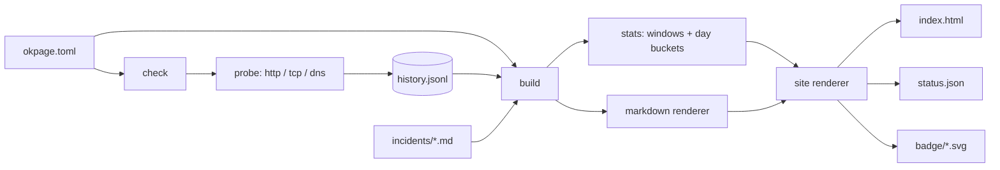

# okpage

[English](README.md) | [中文](README.zh.md) | [日本語](README.ja.md)

[](LICENSE) [](go.mod) [](CHANGELOG.md)  [](CONTRIBUTING.md)

**okpage：开源、零依赖的 CLI，探测你的服务并渲染出可托管在任何地方的静态状态页 —— 输出纯 HTML/JSON，事故（incident）是 markdown 文件而非数据库行。**


```bash
git clone https://github.com/JaydenCJ/okpage && cd okpage
go build -o okpage ./cmd/okpage    # single static binary, stdlib only
```

> 预发布：v0.1.0 尚未发布到任何包仓库；请按上述方式从源码构建（任意 Go ≥1.22）。

## 为什么选 okpage？

状态页只有一个职责：在你的技术栈宕机时它还活着。因此把它跑在你的技术栈*上面*——Uptime Kuma 需要一个 Node 进程加一个数据库 7×24 常驻，自托管面板需要自己的可用性保障——恰恰悄悄违背了初衷；而托管服务对本质上只是一个 HTML 文件的东西按月收费。okpage 像静态网站生成器拆分博客那样拆分这个问题：`okpage check` 由 cron 触发，探测你的服务（HTTP 带状态码/响应体断言、TCP 连接、DNS 解析），把结果追加到一个纯 JSON-lines 文件；`okpage build` 把这份历史加上一个 markdown 事故文件目录，变成自包含的 `index.html`、稳定的 `status.json` 和每服务一枚的 SVG 徽章。产出只是文件——推到 GitHub Pages、S3 或任何最笨的 Web 服务器，你的状态页就能在你自己的故障中幸存，因为服务它不需要你的任何东西在线。历史可以在 git 里 diff，事故可以在故障进行中用手机 SSH 编辑，整个工具是一个零依赖的 Go 二进制。

| | okpage | Atlassian Statuspage | Uptime Kuma | Upptime |
|---|---|---|---|---|
| 部署要求 | 任意静态托管 | 他们的 SaaS | Node + 数据库 7×24 运行 | 仅限 GitHub Pages |
| 你自己宕机时还能活 | ✅ 静态文件 | ✅ 但要付费 | ❌ 它*就是*你的栈 | ✅ |
| 探测类型 | HTTP/TCP/DNS | agent/API | 很多 | HTTP + TCP ping |
| 事故记录 | markdown 文件 | 网页表单、存他们库里 | 数据库行 | GitHub issue |
| 机器可读输出 | ✅ status.json + 徽章 | API（付费档） | 私有 API | 仓库内 JSON |
| 完全离线 / 内网可用 | ✅ | ❌ | ✅ | ❌ 依赖 GitHub Actions |
| 费用 | 免费 | $29/月起 | 免费 | 免费 |
| 运行时依赖 | 0（单二进制） | n/a | Node + npm 依赖树 + 数据库 | GitHub Actions |

<sub>依赖数核对于 2026-07-13：okpage 只导入 Go 标准库；Uptime Kuma 2.x 列出 70+ 个直接 npm 依赖外加 SQLite/MariaDB。</sub>

## 特性

- **三种探测类型、真实断言** —— HTTP GET/HEAD 支持精确状态码或任意 2xx 策略及响应体子串检查，TCP 连接，DNS 解析；并发执行，每服务独立超时。
- **产出只是文件** —— 自包含的 `index.html`（内联 CSS、零 JavaScript、随 `prefers-color-scheme` 切换暗色模式）、稳定的 `status.json`（`schema_version: 1`）、每服务一枚 shields 风格 SVG 徽章。能吐字节的东西都能托管它。
- **事故是 markdown 而非数据库行** —— 每次事故一个文件，front matter 含 `title`/`date`/`status`/`affected`，配一个消毒式 markdown 渲染器；它们在 git 里有版本，故障进行中也能通过 SSH 撰写。
- **讲得清的历史** —— 追加式 JSON lines，原子化保留期裁剪，直接拼接即可合并；损坏的行会连行号一起报告，绝不瞎猜。
- **诚实的可用率计算** —— 24h/7d/90d 滚动窗口加 UTC 自然日条带（正常/降级/宕机/无数据）；"无数据"就渲染成无数据，绝不冒充 0% 或 100%。
- **确定性构建** —— `build` 是 config + history + incidents 的纯函数；相同输入产出逐字节相同的站点，重建结果可以干净地 diff。
- **零依赖、cron 原生** —— 一个静态 Go 二进制；任何服务宕机即退出码 1，让 `okpage check && …` 可以直接当闸门用。无遥测，除你配置的服务外不碰网络。

## 快速上手

```bash
./okpage init status && cd status   # scaffold okpage.toml + incidents/
$EDITOR okpage.toml                 # declare your services
../okpage check --build             # probe, record, render into public/
```

真实捕获的输出（其中一个服务故意是死的）：

```text
   up  Website                  1 ms  200
   up  API                      0 ms  200
 DOWN  Postgres                       dial tcp 127.0.0.1:5432: connect: connection refused
2 up, 1 down
wrote 5 files to public
  index.html
  status.json
  badge/website.svg
  badge/api.svg
  badge/postgres.svg
okpage: 1 of 3 services down
```

`public/status.json` 是它的机器可读孪生（真实输出，有截断）：

```text
{
  "tool": "okpage",
  "version": "0.1.0",
  "schema_version": 1,
  "title": "Acme Status",
  "as_of": "2026-07-13T10:32:27.544291091Z",
  "overall": "degraded",
  "services": [
    {
      "name": "Website",
      "state": "up",
      "latency_ms": 1,
      "last_checked": "2026-07-13T10:32:27.544291091Z",
      "uptime": {
        "24h": 100,
        "7d": 100,
        "90d": 100
      },
      "badge": "badge/website.svg"
    },
    …
```

生产环境就是两行 cron —— 每五分钟探测一次，发布方式随你：

```cron
*/5 * * * *  cd /srv/status && okpage check --build --quiet
7 * * * *    cd /srv/status && rsync -a public/ deploy@web:/var/www/status/
```

## 配置

`okpage.toml` 使用严格的 TOML 子集，报错带行号；未知键会被拒绝，写错字不可能悄悄让某个检查失效。完整参考见 [docs/formats.md](docs/formats.md)。

| 键 | 默认值 | 作用 |
|---|---|---|
| `title` | `"Status"` | 页面标题 |
| `output` | `"public"` | 站点写入目录 |
| `history` | `"history.jsonl"` | 探测历史文件 |
| `incidents` | `"incidents"` | 事故 markdown 目录 |
| `retention_days` | `90` | 裁剪超过此天数的历史 |
| `days` | `90` | 每服务的每日条数（1–365） |
| `timeout` | `"10s"` | 默认探测超时 |

每个 `[[service]]`：`name`、`type`（`http`/`tcp`/`dns`），然后是 `url`/`method`/`expect_status`/`expect_body`（http）、`address`（tcp）、`hostname`（dns），以及可选的每服务 `timeout`。

## 事故就是文件

```markdown
---
title: Elevated API latency
date: 2026-07-10T14:30:00Z
status: resolved
affected: [API, Website]
---

A runaway backup job saturated disk IO. **Resolved** at 14:50 UTC.
```

状态遵循常见的升级阶梯：`investigating` → `identified` → `monitoring` → `resolved`。正文由内置的消毒式 markdown 子集渲染——原始 HTML 会被转义，`javascript:` 一类的链接会被拆除，仓促写就的事故永远不可能往你的页面里注入脚本。

## 验证

本仓库不携带 CI；上述每一条主张都由本地运行验证：

```bash
go test ./...            # 90 deterministic tests, no external network, < 5 s
bash scripts/smoke.sh    # end-to-end CLI check, prints SMOKE OK
```

## 架构



## 路线图

- [x] v0.1.0 —— http/tcp/dns 探测、带裁剪的 JSONL 历史、markdown 事故、静态 HTML/JSON/徽章输出、`init`/`check`/`build` CLI、90 个测试 + smoke 脚本
- [ ] 状态变化时的 Webhook/命令钩子（`on_down = "ntfy publish …"`）
- [ ] 基于已录历史的延迟走势图与 p95
- [ ] 计划维护 front matter（`status: scheduled`，未来日期）
- [ ] 事故的 RSS/Atom 订阅
- [ ] `okpage watch` —— 不依赖 cron 的定时探测，给没有 cron 的机器用

完整列表见 [open issues](https://github.com/JaydenCJ/okpage/issues)。

## 贡献

欢迎 issue、讨论与 PR —— 本地工作流（格式化、vet、测试、`SMOKE OK`）见 [CONTRIBUTING.md](CONTRIBUTING.md)。入门任务标注为 [good first issue](https://github.com/JaydenCJ/okpage/issues?q=is%3Aissue+is%3Aopen+label%3A%22good+first+issue%22)，设计讨论在 [Discussions](https://github.com/JaydenCJ/okpage/discussions)。

## 许可证

[MIT](LICENSE)
